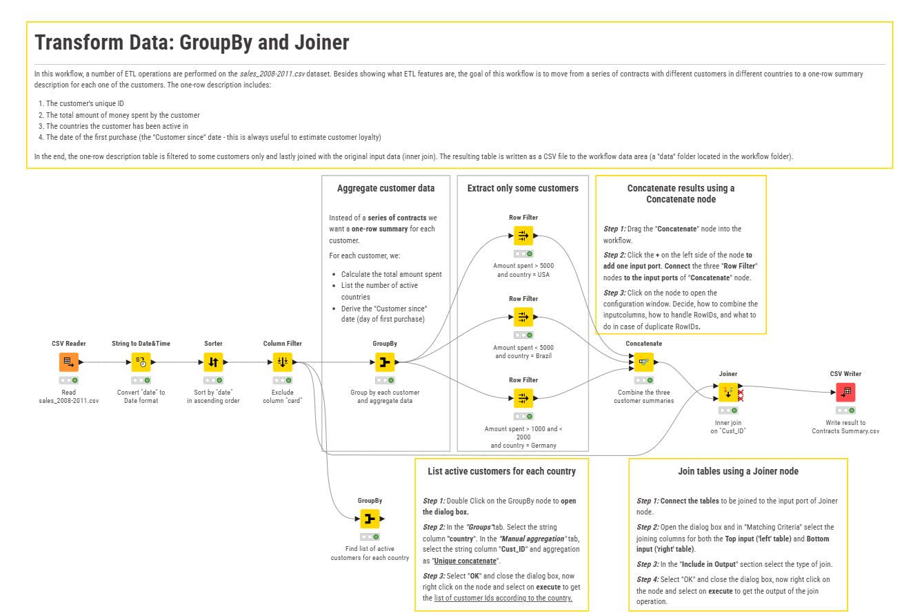
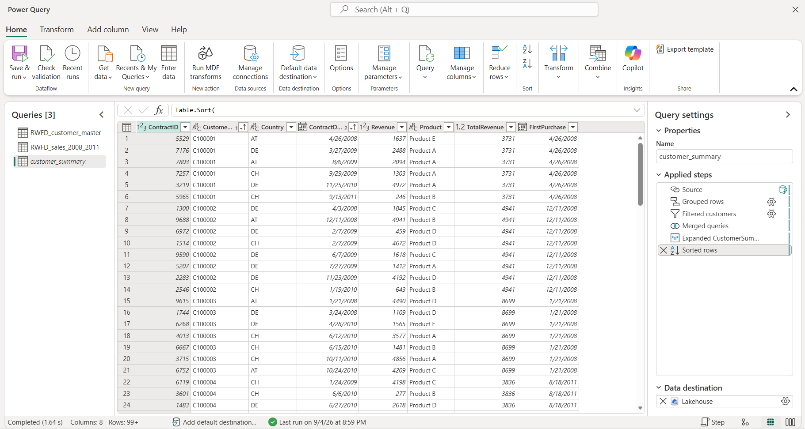

# One Workflow, Three Ways

This project explores how the same data transformation logic can be implemented in Microsoft Fabric using **Dataflow Gen2, SQL and Python**.

The starting point was a simple **KNIME** workflow. Rather than looking for equivalent buttons or nodes, I focused on the underlying data operations and translated them into three different approaches.

## The Workflow

The example uses synthetic transactional sales data.

The transformation:

1. Aggregates transactions by customer and country
2. Calculates total revenue and the first purchase date
3. Applies three different customer filters based on country and revenue
4. Combines the filtered customer groups
5. Joins the selected customers back to the original transaction data
6. Sorts the final result

In simplified form:

**Load → Aggregate → Filter → Combine → Join → Sort**

## Three Implementations

The same transformation logic is implemented using:

- **Dataflow Gen2 / Power Query (M)**
- **SQL**
- **Python / pandas**

In Dataflow Gen2, the transformation is represented as a sequence of Power Query steps:

Although the syntax and interfaces are different, the underlying operations map quite closely:

| KNIME | Dataflow Gen2 | SQL | Python |
|---|---|---|---|
| GroupBy | `Table.Group` | `GROUP BY` | `.groupby()` |
| Row Filter | `Table.SelectRows` | `WHERE` | Boolean filtering |
| Concatenate | `Table.Combine` | `UNION ALL` | `pd.concat()` |
| Joiner | `Table.NestedJoin` | `INNER JOIN` | `.merge()` |
| Sorter | `Table.Sort` | `ORDER BY` | `.sort_values()` |

## Repository

- `workflow.m` – Dataflow Gen2 / Power Query implementation
- `workflow.sql` – SQL implementation
- `workflow.py` – Python implementation

## Takeaway

For this workflow, there is no meaningful winner.

The example is small enough that all three approaches work perfectly well. What changes is how the transformation logic is expressed: visually through Power Query steps, declaratively in SQL, or programmatically in Python.

The useful part of the exercise was seeing that the tools may look very different, while the underlying data logic remains largely the same.

> The syntax changes. The data logic doesn't.

## Note

All data used in this project is synthetic and does not represent real customer or company data.
